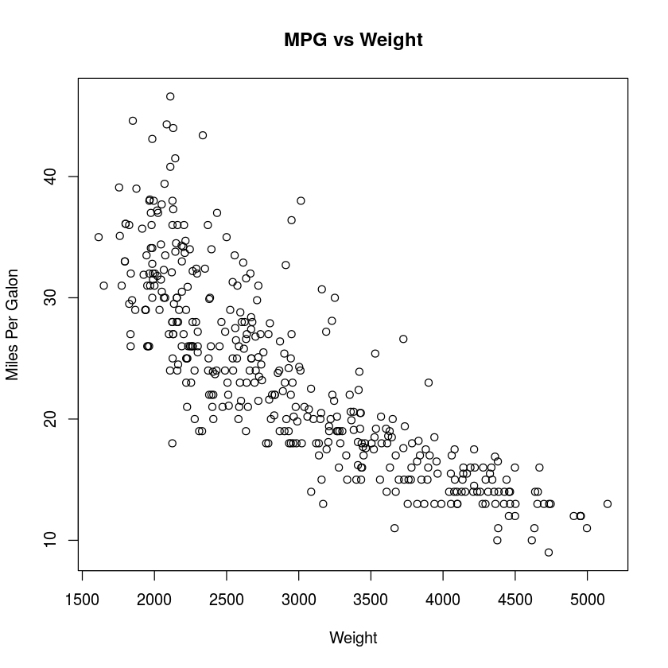
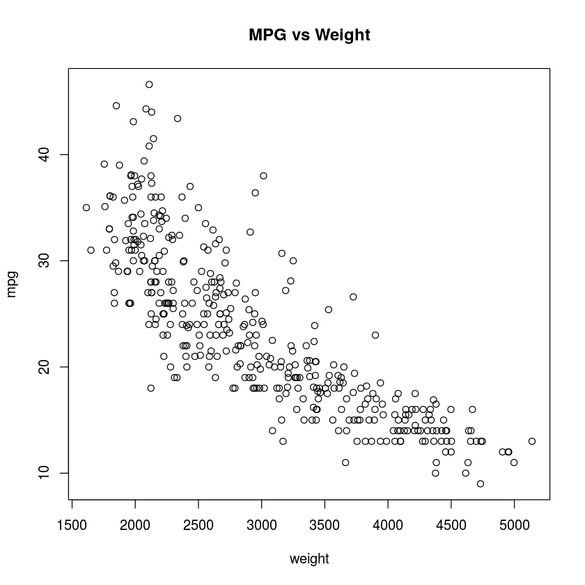
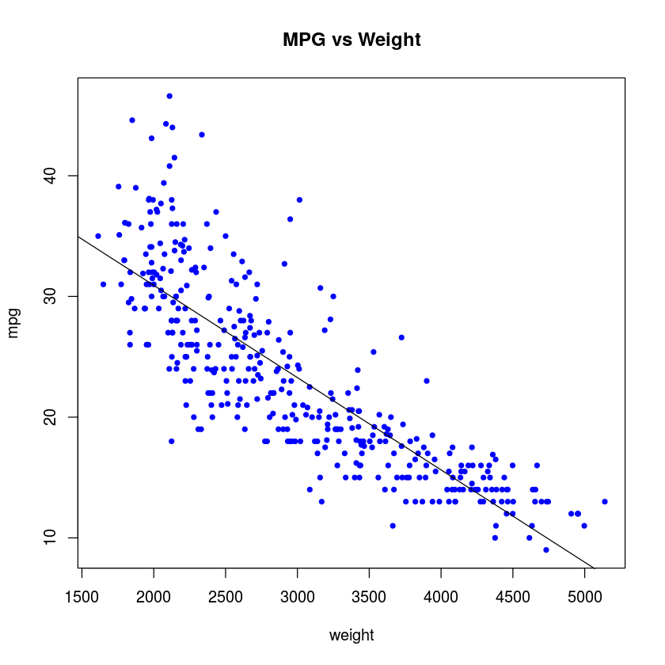

# Visualization

Visualization in R is easier than it is thought. The main logic is all the same; it is better to have the data in form of a data.frame object, otherwise it would be harder to add extra information.

To begin with, we are going to import a sample data; Auto from ISLR package and create another version in matrix form:


```R
library("ISLR")
# ?Auto # Information about the data

auto_matrix <- data.matrix(Auto) # in matrix form
# head(auto_matrix)

head(Auto)
```


<table>
<thead><tr><th scope=col>mpg</th><th scope=col>cylinders</th><th scope=col>displacement</th><th scope=col>horsepower</th><th scope=col>weight</th><th scope=col>acceleration</th><th scope=col>year</th><th scope=col>origin</th><th scope=col>name</th></tr></thead>
<tbody>
	<tr><td>18                       </td><td>8                        </td><td>307                      </td><td>130                      </td><td>3504                     </td><td>12.0                     </td><td>70                       </td><td>1                        </td><td>chevrolet chevelle malibu</td></tr>
	<tr><td>15                       </td><td>8                        </td><td>350                      </td><td>165                      </td><td>3693                     </td><td>11.5                     </td><td>70                       </td><td>1                        </td><td>buick skylark 320        </td></tr>
	<tr><td>18                       </td><td>8                        </td><td>318                      </td><td>150                      </td><td>3436                     </td><td>11.0                     </td><td>70                       </td><td>1                        </td><td>plymouth satellite       </td></tr>
	<tr><td>16                       </td><td>8                        </td><td>304                      </td><td>150                      </td><td>3433                     </td><td>12.0                     </td><td>70                       </td><td>1                        </td><td>amc rebel sst            </td></tr>
	<tr><td>17                       </td><td>8                        </td><td>302                      </td><td>140                      </td><td>3449                     </td><td>10.5                     </td><td>70                       </td><td>1                        </td><td>ford torino              </td></tr>
	<tr><td>15                       </td><td>8                        </td><td>429                      </td><td>198                      </td><td>4341                     </td><td>10.0                     </td><td>70                       </td><td>1                        </td><td>ford galaxie 500         </td></tr>
</tbody>
</table>


### An Old Skool Way
An _old skool_ method to plot is to pass x and y _separately_ into plot function. Notice after executing plot command, title command adds the title over graph.   


```R
## 1 ##
plot(auto_matrix[,5],auto_matrix[,1], xlab="Weight", ylab= "Miles Per Galon")
title("MPG vs Weight")
```





### R Friendly way
However an _R friendly way_ to do this is to use ___y~x notation___ which is the same notation for __regressions, trees, SVM and various others__. This way of plotting is much easier with a data.frame: 


```R
## 2 ##
plot(mpg ~ weight,data=Auto)
title("MPG vs Weight")
```





and the snytax is easier to keep in mind when adding line.


```R
## 3 ##
plot(mpg ~ weight,data=Auto,pch=20,col='blue')
abline(lm(mpg~weight,data=Auto))
title("MPG vs Weight")
```




